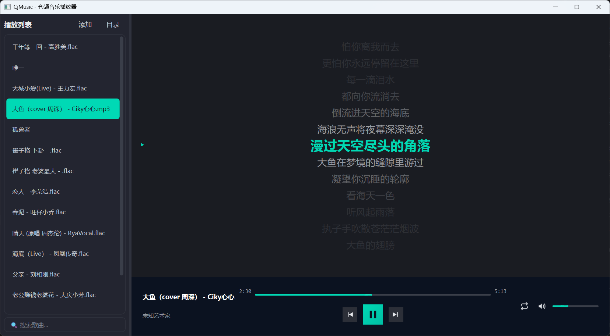

# CjMusic — 基于 CJQT6 + lrc4cj 的本地音乐播放器

> 项目定位：仓颉生态第一个完整的桌面 GUI 音乐播放器
> 技术栈：CJQT6 1.9.x（Qt6 绑定）+ lrc4cj 0.3.0（歌词解析）
> 基线：Cangjie SDK 1.1.0、Qt6（Windows 6.9.1 MSVC / Linux 6.4.2+）、CMake 3.16+
> 目标平台：Windows x64 / Linux x64

---

## 0. 为什么这个组合是对的

### 0.1 它正好补上了仓颉生态的两个空白

之前调研 lrc4cj 时得出的结论是：

| 层 | 状态 | 谁补上 |
|---|---|---|
| 歌词解析 | ✅ lrc4cj 已解决 | — |
| **音频播放输出** | ❌ **生态空白，无库可用** | **CJQT6 multimedia** |
| **GUI** | ❌ 标准库一行都没有 | **CJQT6 widgets** |

当时判断"要做播放器得上 SDL2/miniaudio 的 FFI 封装，是另一个项目"。现在 CJQT6 的 `multimedia` 模块直接提供了 `QMediaPlayer` + `QAudioOutput`，**这条路不用走了**。

两个库都是你维护的，接口、发布节奏、问题定位全在自己手里 —— 这是组合开发最大的优势。

### 0.2 三个"天然不用解决"的问题

这是这个组合最舒服的地方：

**① 中文路径问题消失**

之前 CLI 踩的 `Invalid utf8 byte sequence` 坑，在 GUI 下**根本不存在** —— 文件对话框 / 拖放走系统 UTF-16 API，不经过 CRT argv。lrc4cj 的已知限制在这里自动失效。

**② 播放计时精度问题消失**

CLI 里踩过两个坑：时间 ×100、`stepMs / speed` 整数截断 + 自累加时钟漂移。GUI 播放器里**时间基准来自 `QMediaPlayer.position()`**，不是自己算的，天然无漂移、无累积误差。

**③ 歌词与音频天然对齐**

`QMediaPlayer` 的 `positionChanged(qint64)` 信号直接给出播放位置，喂给 `lrc4cj` 的 `indexAt(timeMs)`（O(log n) 二分）即可定位当前行。不需要任何同步算法。

> 一句话：**lrc4cj 负责"给定位置找歌词"，CJQT6 负责"播放 + 告诉你在哪"，中间只隔一个信号槽。**

---

## 1. 功能范围

### 1.1 v0.1.0（最小可用）

- 打开单个音频文件 / 整个文件夹
- 播放、暂停、停止、上一曲、下一曲
- 进度条拖动（seek）
- 音量调节
- 播放列表（顺序 / 单曲循环 / 列表循环 / 随机）
- **歌词同步显示**（核心）：当前行高亮 + 上下行预览 + 自动滚动
- 从文件名推断歌名歌手

### 1.2 v0.2.0

- 歌词手动偏移校准（±0.5s 微调，写回 lrc）
- 桌面歌词（独立置顶窗口，可透明、可锁定）
- 播放列表持久化（记住上次打开的目录与进度）
- 主题切换（明/暗）

### 1.3 v0.3.0+

- 增强 LRC 逐字高亮（卡拉 OK 效果）
- 音乐库扫描 + 本地索引
- 封面显示（读 ID3 或同目录图片）
- 均衡器 / 音效

### 1.4 非目标

- 不做在线音乐、下载、云同步
- 不做音频格式转换
- 不做视频播放（CJQT6 支持但本项目专注音频）
- 不做 DRM 内容播放

---

## 2. 架构设计

### 2.1 分层

```
┌─────────────────────────────────────────────┐
│  UI 层（cjqt6.widgets）                      │
│  MainWindow / PlaylistWidget / LyricWidget   │
│  ControlBar / VolumeSlider / ProgressBar     │
└──────────────────┬──────────────────────────┘
                   │ 信号槽
┌──────────────────▼──────────────────────────┐
│  控制层（纯仓颉，不依赖 Qt）                  │
│  PlayerController  播放状态机、播放列表逻辑   │
│  LyricController   歌词加载、匹配、偏移校准   │
└──────────┬────────────────────┬─────────────┘
           │                    │
┌──────────▼────────┐ ┌─────────▼─────────────┐
│  cjqt6.multimedia │ │  lrc4cj               │
│  QMediaPlayer     │ │  LrcParser / Lyrics   │
│  QAudioOutput     │ │  indexAt(timeMs)      │
└───────────────────┘ └───────────────────────┘
```

**关键设计**：控制层不依赖 Qt。这样播放列表逻辑、歌词匹配逻辑可以脱离 UI 单测 —— 复用 lrc4cj 的测试经验。

### 2.2 核心同步机制

```cj
import cjqt6.multimedia.*
import lrc4cj.core.*
import lrc4cj.model.*

// 唯一需要连的信号
player.positionChanged.connect({ pos: Int64 =>
    let idx = match (lyrics.indexAt(pos)) {
        case Some(i) => i
        case None => -1
    }
    if (idx != lastIdx) {
        lastIdx = idx
        lyricWidget.highlight(idx)     // 高亮 + 滚动到中间
    }
})
```

**为什么这样就够了**：

| 关注点 | 解法 |
|---|---|
| 定位性能 | `indexAt` 是 O(log n) 二分，`positionChanged` 每秒触发几十次毫无压力 |
| 时间漂移 | 不存在 —— 时间基准是 `QMediaPlayer`，不是自己累加 |
| 重复渲染 | 用 `lastIdx` 挡住，只在换行时更新 UI |

> ⚠️ 注意 `positionChanged` 的触发频率由 Qt 决定（通常 4~20 次/秒），
> **不要在里面做重活**。只做一次二分 + 一次索引比较，其余交给 UI 层。

### 2.3 歌词匹配策略

> ⚠️ 这一节的复杂度被低估了。真实音乐库里**歌名和歌词名对不上才是常态**，
> 仅靠"同名替换扩展名"一条规则，覆盖率不足 70%。

#### 2.3.1 先看一个真实会踩的雷：序号前缀

lrc4cj 的 `parseFileName` 分隔符优先级中 `" - "` 最优先。若直接把带序号的文件名交给它：

```
01 - 海底（Live）.mp3
    ↓ parseFileName
title  = "01"             ← 错
artist = "海底（Live）"    ← 错
```

而 `01 - xxx.mp3` 在专辑抓取的音乐库里极其常见。

**正确做法：播放器侧先清洗，再交给 lrc4cj**：

```
① 剥离序号前缀（01 - / 01. / 01␠ / [01]）
② 剥离质量标签（[HQ] / [SQ] / [320K] / (Live) 保留？见下）
③ 交给 lrc4cj 的 parseFileName / bestTitle / bestArtist
```

> `（Live）` 这类属于标题语义，**保留**（与 lrc4cj 的全角括号策略一致）；
> `[HQ]` `[320K]` 属于质量标签，**剥离**。

#### 2.3.2 分级匹配（惰性升级）

**核心思路**：大多数歌是精确匹配的，所以先做零开销的 O(1) 匹配，失败才升级到需要扫描目录的模糊匹配。

| 级别 | 策略 | 开销 | 增量覆盖 |
|---|---|---|---|
| L1 | 同名替换扩展名 `xx.mp3 → xx.lrc` | O(1) | ~70% |
| L2 | 归一化匹配（大小写 / 空格 / 全角半角 / 扩展名大小写） | O(1) | +15% |
| L3 | 剥离序号前缀 + 质量标签后匹配 | O(1) | +8% |
| L4 | 剥离歌手前缀后匹配 | O(1) | +4% |
| L5 | **目录内模糊打分**（需扫描目录） | O(n) | +2% |
| L6 | 用户手动指定 | — | 兜底 |

L1~L4 都是**纯字符串变换 + 一次文件存在性判断**，不遍历目录，切歌时零感知。
只有 L5 需要扫描 —— 且只在前四级全失败时才触发。

**真实场景覆盖示例**：

| 歌曲文件 | 歌词文件 | 命中级别 |
|---|---|---|
| `海底.mp3` | `海底.lrc` | L1 |
| `Song.MP3` | `song.lrc` | L2 |
| `海底 (Live).mp3` | `海底（Live）.lrc` | L2（全角半角） |
| `01 - 海底.mp3` | `海底.lrc` | L3 |
| `凤凰传奇 - 海底.mp3` | `海底.lrc` | L4 |
| `01.海底[HQ].mp3` | `01 海底.lrc` | L5 |

#### 2.3.3 目录扫描的缓存设计

L5 是唯一的 O(n) 操作，必须缓存，否则切歌会卡：

```cj
// 按目录缓存 .lrc 文件名列表
class LyricDirCache {
    let cache: HashMap<String, Array<String>>   // 目录路径 → 该目录下的 .lrc 文件名

    func listLrc(dirPath: String): Array<String> {
        match (cache.get(dirPath)) {
            case Some(list) => list             // 命中缓存，零 IO
            case None =>
                let list = Directory.readFrom(Path(dirPath))
                    .filter({ e => e.name.endsWith(".lrc") })
                cache[dirPath] = list
                list
        }
    }
    func invalidate(dirPath: String): Unit      // 目录内容变更时失效
}
```

**收益**：同一目录连续切歌，只有第一首触发扫描。

#### 2.3.4 多候选打分

L5 可能匹配到多个（`海底.lrc` 与 `海底（Live）.lrc` 同时存在）。用打分而非取第一个：

| 匹配情形 | 分值 |
|---|---|
| 精确同名 | 100 |
| 归一化后完全相同 | 90 |
| 剥离装饰后相同 | 80 |
| 一方包含另一方（前缀/后缀） | 60 |
| 编辑距离相似度 | 0~50 按比例 |

**同分处理**：取文件名**更短**的那个 —— `海底.lrc` 比 `海底（Live）.lrc` 更可能是"干净版本"。

⚠️ 但这只是启发式，**必须在 UI 上可切换**，不能硬猜死。

#### 2.3.5 失败时的用户体验

不要只显示"未找到歌词"就结束：

1. 明确提示"未找到歌词"，**不静默失败**
2. 提供"手动选择歌词文件"入口
3. **记住用户的选择**（存配置，key = 音频文件绝对路径）
4. 下次遇到同一首歌直接用记住的

第 3 点很关键 —— 用户手动指定一次后不该再问第二次。

#### 2.3.6 显示匹配来源（反直觉但重要）

**匹配到歌词后，把实际使用的 `.lrc` 文件名显示出来**（或 hover 可见）。

理由：模糊匹配一旦匹配错，用户会以为"歌词内容错了"，而不是"匹配错了"。
显示来源能让问题立刻定位，比事后 debug 便宜得多。

#### 2.3.7 匹配时机：**切歌时惰性匹配**（明确）

> ⚠️ **不要在加载播放列表时批量匹配歌词。**

理由：拖入一个几千首的文件夹时，若对每首都走一遍 L5（扫描目录），
即使有 `dir_cache`，首次加载仍会造成明显卡顿。

**正确做法**：只在**切歌时**匹配当前这一首。

```
用户拖入文件夹 → 只建立播放列表（音频文件）
      ↓
用户点击/自动切歌 → 才为这一首匹配歌词
```

匹配结果按音频路径缓存（`Map<音频路径, lrc路径>`），来回切歌不会重复匹配。

> 例外：若用户明确点击"扫描歌词库"按钮，可批量匹配并缓存 —— 这是主动操作，卡顿可接受。

#### 2.3.8 歌词解析失败的兜底

lrc4cj 对 GBK 会自动回落，但**仍可能遇到它也无法识别的编码**（如 UTF-16、BIG5）。
此时它抛出的不是空结果，而是 `LrcException`。

**必须捕获，否则播放器崩溃**：

```cj
let lyrics = try {
    LrcParser().parse(lrcPath)
} catch (e: LrcException) {
    lyricWidget.showError("歌词解析失败（编码不支持）")
    return
}
```

歌词区显示"歌词解析失败（编码不支持）"，**不显示乱码、不崩溃、不影响播放**。

> 支持的编码以 lrc4cj v0.3.0 为准：UTF-8 / GBK / GB18030。
> UTF-16 目前会显式抛异常 —— 这正是需要 UI 兜底的原因。

#### 2.3.9 非时间戳行的处理（元数据行 / 纯文本行）

LRC 文件不只有 `[00:12.34]` 时间戳行，还可能混入：

| 类型 | 示例 | lrc4cj 行为 |
|---|---|---|
| 元数据标签 | `[ti:海底]` `[ar:凤凰传奇]` | 解析进 `meta`，**不进 `lines`** |
| 带时间戳的制作信息 | `[03:55.25]音乐总监：刘卓` | 进 `lines`（这是正常的） |
| **无时间戳的纯文本行** | 文件末尾的散落文本 | 普通 `parse()` 跳过；`parsePlain()` 会保留 |

**播放器绘制时必须过滤**：

```cj
let drawable = lyrics.lines.filter({ l => l.start >= 0 })
```

`start < 0` 的行（plain 模式等）**不绘制**，否则歌词区会出现时间戳错乱的行，
表现为"歌词莫名多出几行、顺序跳跃"。

#### 2.3.10 `dir_cache` 的失效时机

2.3.3 的 `invalidate()` 何时调用？**不监听文件系统**（过于复杂，收益低）。

| 时机 | 是否失效 |
|---|---|
| 用户手动"刷新播放列表" | ✅ 清空 |
| 用户切换到另一个目录 | ✅ 清空 |
| 用户手动指定歌词文件后 | ✅ 清空（可能新增了 .lrc） |
| 程序启动 | ✅ 天然为空 |

> 简单粗暴即可 —— 用户想让新歌词生效，点一下刷新。
> 用 `QFileSystemWatcher` 监听是过度设计，v0.1.0 不做。

#### 2.3.11 歌词加载要点

- 用 `LrcParser().parse(path)` —— 中文路径在 GUI 下没问题
- 元数据为空时用 `bestTitle()` / `bestArtist()` 从文件名兜底
- GBK 编码的老歌词由 lrc4cj 自动回落，播放器不用管

#### 2.3.12 需反馈给 lrc4cj 的改进

**序号前缀剥离应该放在 lrc4cj，而不是播放器**。

理由：这是文件名推断的通用问题，不只播放器会遇到；放在 `parseFileName` 里可以让两个项目都受益。

建议 lrc4cj v0.4.0 增加：

```cj
// 方案 A：可选参数
parseFileName(path, order, stripTrackNumber: true)

// 方案 B：默认剥离（更推荐，序号前缀几乎不可能是歌名的一部分）
```

> 在此之前，播放器在调用 `bestTitle()` / `bestArtist()` **之前**自行清洗（见 2.3.1）。

### 2.4 播放状态机（M1 必须对接）

**不能用点击逻辑硬编码按钮图标**，必须以 Qt 信号为准：

| 信号 | 用途 |
|---|---|
| `playbackStateChanged(state)` | 切换播放/暂停按钮图标（▶ / ⏸） |
| `mediaStatusChanged(status)` | `EndOfMedia` → 触发自动下一曲 |
| `positionChanged(pos)` | 进度条 + 歌词定位 |
| `durationChanged(dur)` | 进度条最大值 + 总时长显示 |
| `errorOccurred(err, msg)` | 文件丢失/损坏时提示 |

**为什么必须用 `playbackStateChanged` 而非点击逻辑**：
用户可能通过系统媒体键、耳机线控、或 `setSource` 后自动播放改变状态 —— 这些都不会经过你的点击回调。

**边界状态处理**（必须明确，否则会崩）：

| 场景 | 行为 |
|---|---|
| 播放列表为空时点播放 | **按钮置灰**，或静默忽略；不崩溃 |
| 移除正在播放的歌曲 | 停止播放并清空歌词区（**不做自动切下一曲**，避免意外行为） |
| 文件被删除后点击播放 | `errorOccurred` 触发，提示"文件不存在或已损坏"，并标记该列表项为无效 |
| seek 到超出范围 | Qt 内部处理，无需特殊逻辑 |

### 2.5 搜索过滤与播放队列的关系

v0.2.0 加搜索框时，必须遵守：

> **过滤只影响 UI 显示，不影响底层播放队列索引。**

即搜索时隐藏的行，其原始索引 `index` 保持不变。否则会出现"搜到第二首，点进去播的是第五首"的错乱。

实现：UI 层维护 `visibleRows: [Int]`（筛选后的原始索引列表），播放/双击时取 `visibleRows[uiRow]` 而非 `uiRow`。

音量映射（4.3 节补充）：

```cj
// QSlider 是 0~100 整数，QAudioOutput 要 0.0~1.0
audioOutput.setVolume(Float64(slider.value()) / 100.0)
```

---

## 3. 技术要点与坑

### 3.1 Qt6 的 multimedia 与 Qt5 完全不同

这是最容易踩的，Qt6 做了架构调整：

| 变化 | Qt5 | Qt6 |
|---|---|---|
| 音频输出 | `QMediaPlayer` 自带 | **必须 `setAudioOutput(QAudioOutput)`，否则没声音** |
| 音量 | `player.setVolume(0-100)` | **`audioOutput.setVolume(0.0-1.0)`** |
| 播放列表 | `QMediaPlaylist` | **已移除，自己管理** |
| 设置源 | `setMedia(QMediaContent)` | `setSource(QUrl)` |

**最小可用代码**：

```cj
let player = QMediaPlayer()
let audioOutput = QAudioOutput()
player.setAudioOutput(audioOutput)      // ← 漏了这行就没声音
audioOutput.setVolume(0.5)              // ← 0.0~1.0，不是 0~100
player.setSource(QUrl.fromLocalFile(path))
player.play()
```

### 3.2 CJQT6 特有的构建约束

- **构建顺序不可颠倒**：先 `scripts/update-bridge.ps1` 重编桥接库，**再** `cjpm build`
- **桥接库对 Qt 小版本敏感** —— 换 Qt 版本必须重编 bridge
- 环境变量：`CJQT6_ROOT` + `QTDIR`
- **写代码前先读 `.agents/skills/cjqt6/SKILL.md`** —— 含模块地图、信号槽写法、内存管理陷阱

### 3.3 生命周期：Qt 父子树

CJQT6 有反向失效存活表，但父子对象树的语义仍在：父对象析构会带走子对象。

**实践建议**：
- 所有 widget 创建时指定 parent（构造时传 parent 参数）
- 不要手动 delete 有 parent 的对象 —— 会 double-free
- 信号连接在对象销毁前断开，或用 CJQT6 的自动断开

### 3.3.1 ⚠️ 仓颉 GC 与播放器对象的生命周期（关键）

**这是本项目的头号崩溃风险，比 Qt 父子树更隐蔽。**

`QMediaPlayer` / `QAudioOutput` 在仓颉侧是对象。如果写成 `main()` 里的局部变量：

```cj
main() {
    let player = QMediaPlayer()          // ← 危险
    let audioOutput = QAudioOutput()
    ...
    app.exec()                            // 事件循环期间，player 可能已被 GC 回收
}
```

`app.exec()` 会长时间阻塞在事件循环里，此时 `main` 栈帧中的局部变量**可能被仓颉 GC 判定为不可达而回收** —— 后果是播放到一半突然中断，或直接崩溃。

**必须这样持有强引用**：

```cj
// 方案 A（推荐）：作为 MainWindow 的成员变量
class MainWindow <: QMainWindow {
    let player: QMediaPlayer
    let audioOutput: QAudioOutput
    init() {
        player = QMediaPlayer()
        audioOutput = QAudioOutput()
        player.setAudioOutput(audioOutput)
    }
}

// 方案 B：顶层全局强引用
let gPlayer = QMediaPlayer()
main() {
    ...
    app.exec()
}
```

**同理适用于**：
- `LyricWidget`（自绘部件必须在窗口生命周期内存活）
- 所有连接了信号的回调对象
- `QTimer`（若用于滚动动画）

> M0 验证时务必观察：播放 3~5 分钟后是否还在响。若中途静音/崩溃，大概率是 GC 回收。

### 3.3.2 中文路径与 `QUrl.fromLocalFile`

之前确认 GUI 下中文路径不像 CLI 那样报 `Invalid utf8 byte sequence`，但仍需验证一点：

> `QUrl.fromLocalFile(path)` 接收的 `String` 若非 UTF-8，可能生成错误的 URL 导致**静默播放失败**（不报错，但没声音）。

**M0 第 6 项验证**：用一个**中文路径的 mp3 + 中文路径的 lrc** 完整走一遍 ——
从 `QFileDialog` 拿路径 → `QUrl.fromLocalFile` → `player.setSource` → 播得出声 + 歌词正确加载。

这条不验证，M1 写完才发现播不了中文名的歌，返工成本很高。

### 3.4 跨线程

`QMediaPlayer` 的信号（如 `positionChanged`）从 Qt 内部线程发出。CJQT6 支持 `QueuedConnection` 跨线程连接。

**本项目 v0.1.0 不需要多线程** —— 都在主线程跑，`positionChanged` 里只做一次二分，不会卡 UI。歌词文件解析（IO）如果慢再考虑挪到子线程，但 lrc4cj 解析一个几十 KB 的文件是毫秒级，大概率不需要。

### 3.5 seek 后的歌词跳转

用户拖动进度条时，`positionChanged` 会拿到新位置，`indexAt` 直接返回对应行 —— **无需特殊处理**，二分定位天然支持随机跳转。

唯一要处理的是：**拖动中不要每帧都滚动歌词**（会闪）。可以加个 `isSeeking` 标志，松手后再更新。

---

## 4. UI 设计

### 4.1 界面效果图



> 深色主题，左右分栏布局：
> - **左栏**：播放列表（当前播放项青蓝色高亮 + 音符图标）
> - **右上**：歌词显示区（当前行青蓝高亮居中，上下行半透明灰，渐变模糊）
> - **右下**：状态与控制区（文件名、进度条、播放控制、音量）
>

### 4.2 布局结构

```
┌──────────────┬──────────────────────────────────┐
│  播放列表  ＋ │  ♪ 海底（Live）          ─ □ ×   │
│              │     凤凰传奇                       │
│ ▶ ♪ 海底(Live)├──────────────────────────────────┤
│   月亮之上    │                                  │
│   荷塘月色    │        （上一行，灰色）            │
│   自由飞翔    │     ▶  散落的月光穿过了云  ← 高亮  │
│   最炫民族风  │        （下一行，灰色）            │
│   奢香夫人    │            ...                   │
│              ├──────────────────────────────────┤
│ 🔍 搜索       │  海底（Live）-凤凰传奇.mp3        │
│              │  ◀◀  ▶  ▶▶  ▬▬▬▬──── 02:15/04:12 │
│              │                          🔊 ▬▬──  │
└──────────────┴──────────────────────────────────┘
     左栏 1/3              右栏 2/3
                    右上 2/3 歌词 / 右下 1/3 控制
```

**选择左右分栏而非上下分栏的理由**：

- 歌词区获得完整宽度，可显示更多上下文行，双击跳转的操作空间更大
- 播放列表常驻可见，切歌无需弹出面板
- 控制区固定在右下，视觉重心稳定

### 4.3 控件映射

| 区域 | CJQT6 控件 | 备注 |
|---|---|---|
| 整体分栏 | `QSplitter` | 可拖动调整左右比例 |
| 左栏列表 | `QListWidget` + `QVBoxLayout` | 自定义 item 绘制高亮态 |
| 左栏搜索 | `QLineEdit` | v0.2.0 实现过滤，见 2.5 |
| **打开文件** | **`QFileDialog`** | **M0 验证**；过滤器 `*.mp3 *.flac *.wav *.m4a` |
| **拖拽导入** | **`setAcceptDrops` + `dropEvent`** | **M0 第 8 项验证**（4.6 节） |
| 右上歌词 | **自绘 `QWidget`** | 唯一难点，见下 |
| 右下进度 | `QSlider`（Horizontal） | `setPosition` / `positionChanged` |
| 右下按钮 | `QPushButton` × 3 | 上一曲 / 播放暂停 / 下一曲 |
| 右下音量 | `QSlider` + 喇叭图标 | `slider.value() / 100.0` → `setVolume`（见 2.5） |

**v0.1.0 支持格式**：`mp3` / `flac` / `wav` / `m4a`
> 实际可用性取决于系统 codec，Qt multimedia 不自带解码器。
> Windows 通常够用；Linux 需装 `gstreamer` 相关插件（见第 7 节风险表）。

**歌词区是自绘部件**（`paintEvent`），因为需要：

1. 当前行高亮 + 光晕
2. 上下行逐级半透明（距当前行越远越淡）
3. 平滑滚动（当前行始终居中）

这是 UI 层唯一有实现难度的部分，其余都是标准控件堆叠。

### 4.4 歌词区绘制实现（`paintEvent`）

**绘制流程**：

1. 以 `lastIdx` 为中心，取 ±N 行（建议 ±5，其余不画）
2. 基准 Y = 控件高度的一半（当前行居中）
3. 逐行计算 Y：`centerY + (i - lastIdx) * lineHeight + scrollOffset`
4. 按"距当前行的距离"决定样式：

| 距离 | 字号 | 颜色 | 透明度 |
|---|---|---|---|
| 0（当前行） | 大号粗体 | 青蓝 `#4dd0e1` | 255 |
| ±1 | 中号 | 白 | ~150 |
| ±2 | 中号 | 白 | ~80 |
| ±3 及以上 | 中号 | 白 | ~40（或干脆不画） |

5. 当前行左侧画 `▶` 三角（drawPolygon）
6. 光晕：用 `QColor` 半透明色多次描边，或 `QPainterPath` 描边

**⚠️ 性能提醒**：光晕若用"多次 drawText 叠加"实现，每秒几十次重绘会有开销。
优先用**单层文字 + 半透明色**模拟，只在确认性能有余量时再上真光晕。

### 4.5 平滑滚动：三个必须处理的坑

`positionChanged` 是离散触发（4~20 次/秒），直接跳变会"闪现"。需要插值动画，但这里有**三个容易踩的坑**：

**坑 1：动画打断（最常见）**

`positionChanged` 触发间隔可能短于动画时长（300ms）。若每次都重置 `startY = currentY`，动画会不断被打断、歌词抖动。

```
❌ 错误：每次 highlight() 都 startY = currentY, endY = newTarget
✅ 正确：新 target 到来时，startY = 当前动画位置，endY = newTarget，重新计时
```

即**从当前视觉位置继续插值**，而不是从旧起点重来。

**坑 2：双击跳转的坐标反查要减去滚动偏移**

反查公式不能只用 `(clickY - centerY) / lineHeight`，因为画面上有滚动偏移：

```cj
let rowOffset = (clickY - centerY - scrollOffset) / lineHeight
let clickedIdx = lastIdx + rowOffset
```

漏掉 `scrollOffset` 会导致跳转偏移一两行 —— 这种 bug 很隐蔽，因为静止时是对的，滚动中才错。

**坑 3：高频重绘**

`QTimer` 16ms 一次 + `update()` 全量重绘。若歌词行少（十几行）无压力；若用真光晕 + 大字体，需实测掉帧情况。

**⚠️ 坑 4：`QTimer` 默认是粗精度计时器**

`QTimer` 默认 `Qt::CoarseTimer`，误差可达 **5%**（16ms 可能实际 15~17ms 抖动），
会导致滚动动画**微顿、不够顺滑** —— 这种"差一点"的手感很难描述，但用户能感觉到。

**必须设置为精确计时器**：

```cj
timer.setTimerType(Qt.PreciseTimer)    // 精度 1ms
```

> **M0 需确认 CJQT6 是否暴露 `setTimerType` / `Qt.PreciseTimer`。**
> 若未暴露，降级方案：动画时长从 300ms 放宽到 400ms，用更长的时间掩盖抖动 ——
> 虽然不够精确，但视觉上比"快速但抖"更舒服。

**降级方案**（CJQT6 若无 `QPropertyAnimation`）：

```cj
// 自写插值器，QTimer 驱动（注意设 PreciseTimer）
currentY = startY + (endY - startY) * (elapsed / duration)
```

### 4.6 拖拽支持（播放器标配）

拖文件/文件夹到窗口是硬需求，比 `QFileDialog` 更高频。

```cj
window.setAcceptDrops(true)
// 重写 dragEnterEvent（接受 *.mp3 等）
// 重写 dropEvent（拿到路径列表 → 加入播放列表）
```

**⚠️ M0 第 8 项验证**：CJQT6 的 `QWidget` 是否暴露 `setAcceptDrops` / `dropEvent`。

| 情况 | 对策 |
|---|---|
| 支持 | 作为主要入口，`QFileDialog` 作为备选 |
| 不支持 | 只用 `QFileDialog`；勉强可用，但体验打折 |
| 部分支持（能接文件不能接目录） | 拖拽文件 + `QFileDialog` 选目录 |

### 4.7 图标资源

设计图中的播放/暂停/上下曲/音量/搜索图标，按优先级：

| 方案 | 说明 | 优先级 |
|---|---|---|
| SVG + `QIcon` | 最清晰，可随 DPI 缩放 | 首选，需确认 CJQT6 支持 |
| SVG + QSS `border-image` | 备选 | 次选 |
| **Unicode 字符** | `▶` `⏸` `⏮` `⏭` `🔊` `🔍` | **兜底**，零依赖但跨平台字形不一致 |

> M0 需确认 CJQT6 是否支持 `QIcon` / `.qrc` 资源。若不支持，先用 Unicode 兜底，视觉差异可接受。

---

## 5. 项目结构

```
CjMusic/
├── cjpm.toml
├── README.md
├── CHANGELOG.md
└── src/
    ├── main.cj
    ├── player/
    │   ├── controller.cj        # 播放状态机（不依赖 Qt）
    │   ├── playlist.cj          # 播放列表 + 四种模式
    │   ├── lyric_matcher.cj     # L1~L4 分级匹配（纯字符串，可单测）
    │   ├── lyric_scorer.cj      # L5 打分（纯函数，可单测）
    │   ├── name_normalizer.cj   # 序号/质量标签清洗（纯函数，可单测）
    │   └── dir_cache.cj         # 目录 .lrc 列表缓存
    ├── lyric/
    │   ├── lyric_controller.cj  # 封装 lrc4cj，含偏移校准
    │   └── geometry.cj          # ★ 纯函数：坐标/行号计算，可单测
    ├── ui/
    │   ├── main_window.cj        # QSplitter 左右分栏骨架
    │   ├── lyric_widget.cj       # 自绘歌词：只做绘制，计算全调 geometry
    │   ├── control_bar.cj        # 右下：文件名 / 进度 / 按钮 / 音量
    │   └── playlist_widget.cj    # 左侧：列表 + 搜索框
    └── test/
        ├── playlist_test.cj     # 纯逻辑，无需 Qt
        ├── lyric_matcher_test.cj   # L1~L4 各级别用例
        ├── lyric_scorer_test.cj    # 打分与同分取短
        └── name_normalizer_test.cj # 序号/质量标签/全角半角清洗
        ├── lyric_controller_test.cj
        └── geometry_test.cj     # ★ 坐标/行号计算，无需启动 Qt
```

**测试策略**：`player/` 和 `lyric/` 不依赖 Qt，可以直接单测 —— 这部分应该保持高覆盖率，复用 lrc4cj 的经验（`cjpm build --coverage` + `cjcov`）。

**关键设计：UI 计算逻辑抽离为纯函数**

`lyric/geometry.cj` 把歌词区的坐标与行号计算抽成纯函数，`lyric_widget.cj` 只负责调用与绘制：

```cj
// lyric/geometry.cj —— 不依赖 Qt，可直接单测
public func calcRowY(rowIdx: Int64, curIdx: Int64, centerY: Int64,
                     lineHeight: Int64, scrollOffset: Int64): Int64

public func calcRowIndex(clickY: Int64, centerY: Int64, scrollOffset: Int64,
                         lineHeight: Int64, curIdx: Int64): Int64

public func calcAlpha(distance: Int64): Int64      // 距当前行的距离 → 透明度
public func calcFontSize(distance: Int64): Int64   // 距当前行的距离 → 字号
```

**收益**：
- 4.5 节的「坑 2」（坐标反查漏 `scrollOffset`）能被单测直接抓住，不用靠肉眼看
- 透明度/字号的衰减曲线可独立调参与回归
- UI 层只剩"调用纯函数 + 调 `drawText`"，出 bug 的范围最小

> 这是把 lrc4cj 的"逻辑与 IO 分离"经验复用到 UI 层 —— 自绘部件最容易变成不可测试的泥球，
> 抽离纯函数是唯一的解药。

---

## 6. 里程碑

| 阶段 | 产出 | 预估 |
|---|---|---|
| **M0** | **环境验证（见下方八项清单，必须全过）** | **1.5~2 天** |
| M1 | 最小播放器：打开文件、播放/暂停、音量、进度条 | 2 天 |
| M2 | 播放列表（四模式）+ 上一曲/下一曲 | 1.5 天 |
| M3 | **歌词同步**：匹配（L1~L5）+ 加载 + 高亮（先不做动画） | 2.5 天 |
| M4.1 | 控件布局 + QSS 定制（分栏、列表、按钮、滑块） | 1 天 |
| M4.2 | **歌词区自绘 + 平滑滚动 + 双击跳转** | 1.5 天 |
| M5 | 测试 + 打包发布 | 1.5 天 |

**合计约 11.5~12 天**（原估 9 天；M0 验证细化 +1，M4 拆分 +0.5，M3 匹配细化 +0.5）。

> 工期上调的依据：M4 原本只有"布局 + 样式 + 双击跳转"，加入歌词区自绘（`paintEvent`）、
> 平滑滚动插值、QSS 定制后，1.5 天过于紧张。拆成 M4.1 / M4.2 更现实。

### M0 验证清单（八项，缺一不可）

M0 从 0.5 天调整为 **1.5~2 天**，因为要额外验证绘制能力、文件对话框与拖拽。

| # | 验证项 | 方法 | 不通过的后果 |
|---|---|---|---|
| 1 | CJQT6 构建流程 | `update-bridge.ps1` → `cjpm build` | 项目无法启动 |
| 2 | lrc4cj 中心仓依赖 | 新项目 `cjpm build` 引入 `lrc4cj = "0.3.0"` | 需改本地路径依赖 |
| 3 | `QMediaPlayer` 播放 | 能否 `setAudioOutput`、播 mp3 出声 | **核心功能不成立** |
| 4 | `positionChanged` 信号 | 能否连接、回调频率 | 歌词同步不成立 |
| 5 | **`QPainter` 绘制能力** | **50 行小例子：画几行不同透明度的文字** | 歌词区视觉需降级 |
| 6 | **`QFileDialog` + 中文路径** | 中文路径 mp3 + lrc 全流程走通 | 中文名的歌播不了 |
| 7 | **GC 长时运行** | 播放 3~5 分钟不中断 | 播放中途崩溃 |
| 8 | **拖拽 `dropEvent`** | `setAcceptDrops` + 拖文件进窗口 | 只能靠对话框导入 |

**第 5 项具体验证点**（`cjqt6.paint` 模块）：
- `drawText` 能否正常绘制中文
- `QColor` 是否支持 alpha 通道（透明度）
- `setFont` 能否设置字号/粗体
- `cjqt6.core` 是否有 `QPropertyAnimation`（没有则用 `QTimer` 插值替代）
- 是否支持 `QIcon` / `.qrc` 资源（不支持则图标用 Unicode 兜底）

**第 6 项具体验证点**：
- `cjqt6.dialogs` 是否封装 `QFileDialog`（打开单个文件 + 选择目录）
- 是否支持 `setNameFilter`（如 `*.mp3 *.flac *.wav *.m4a`）
- 返回的中文路径传给 `QUrl.fromLocalFile` 后能否正常播放
- 同目录中文名 `.lrc` 能否被 lrc4cj 正确加载

**第 8 项具体验证点**：
- `QWidget.setAcceptDrops(true)` 是否存在
- `dragEnterEvent` / `dropEvent` 能否重写并拿到路径列表
- 拖**文件夹**能否拿到目录路径（不只是文件）

**降级方案汇总**：

| 项 | 不通过时的降级 |
|---|---|
| 5 `QPainter` | 去掉光晕与渐变模糊，只保留"当前行高亮 + 其余灰色" |
| 6 `QFileDialog` | 用 `QLineEdit` 输入路径，或命令行参数 |
| 8 拖拽 | 只用 `QFileDialog`；能拖文件不能拖目录也可接受 |

> ⚠️ 这 8 项里，**第 5、6、7、8 项最容易翻车且最晚被发现**。
> UI 写完了才发现 `QPainter` 能力不足、中文歌播不了、播放几分钟就崩、或拖不了文件，
> 返工成本远高于 M0 花两天验证。
>
> M0 必须先做。CJQT6 的构建（bridge 重编 + 版本敏感）和 lrc4cj 的中心仓依赖接入各有一层不确定性，先验证再写业务代码。

---

## 7. 风险与对策

| 风险 | 等级 | 说明 | 对策 |
|---|---|---|---|
| **Qt 版本敏感** | 🔴 高 | bridge 对 Qt 小版本敏感，换版本需重编 | 锁定 Qt 版本并写进 README；M0 验证一次完整构建流程 |
| **lrc4cj 是 dynamic** | 🟡 中 | 打包要带 `lrc4cj.dll` + charset4cj 的多个 dll | **发布前建议 lrc4cj 改 static**（趁用户还少）；即便改了 charset4cj 的 dll 仍需携带 |
| **CJQT6 multimedia 覆盖度未知** | 🟡 中 | 13 个模块含 multimedia，但 `QMediaPlayer` 具体封装到什么程度未验证 | **M0 必须验证**：能否创建 player、连接 positionChanged、播放 mp3 出声 |
| **`QPainter` 绘制能力未知** | 🟡 中 | 歌词区自绘依赖 `drawText` / `QColor` alpha / `setFont`，若能力不足需降级 | **M0 第 5 项验证**；降级方案：去光晕与渐变，仅保留高亮 |
| 无 `QPropertyAnimation` | 🟢 低 | CJQT6 可能未封装动画类 | 用 `QTimer` 16ms 手动插值替代（4.5 节） |
| 图标资源加载 | 🟢 低 | 可能不支持 `QIcon` / `.qrc` | Unicode 字符兜底（4.6 节） |
| **仓颉 GC 回收播放器对象** | 🔴 高 | `main()` 局部变量的 `QMediaPlayer` 可能被 GC 回收，播放中断或崩溃 | **必须作为 MainWindow 成员或顶层全局强引用**（3.3.1 节）；M0 第 7 项长时验证 |
| `QFileDialog` 未封装 | 🟡 中 | CJQT6 `dialogs` 模块可能无文件对话框 | **M0 第 6 项验证**；降级用 `QLineEdit` 输入路径 |
| 中文路径 URL 编码 | 🟡 中 | `QUrl.fromLocalFile` 若收非 UTF-8 会静默失败（不报错但没声音） | **M0 第 6 项验证**：中文 mp3 + 中文 lrc 全流程 |
| 文件被删除后播放 | 🟡 中 | `QMediaPlayer` 会报错 | 监听 `errorOccurred`，提示并标记无效项（2.4 节） |
| 无音频编解码器 | 🟡 中 | Qt multimedia 依赖系统 codec，Linux 上可能缺 | Linux 需装 `libxkbcommon-x11-0` + gstreamer 插件；README 写明 |
| 歌词匹配失败 | 🟡 中 | 大部分音乐的文件名与歌词名对不上，仅"同名替换"覆盖率不足 70% | L1~L5 分级匹配（2.3 节）+ 显示匹配来源 + 记住用户手动选择 |
| 歌词匹配错误（非失败） | 🟡 中 | 模糊匹配可能匹配到错误的歌词，用户会误以为歌词内容错了 | 多候选打分 + 同分取短 + **UI 可切换** + 显示来源文件名 |
| 歌词解码失败 | 🟡 中 | lrc4cj 不支持的编码会抛 `LrcException` | **必须 try-catch**，显示"歌词解析失败（编码不支持）"，不崩溃（2.3.8） |
| **大播放列表渲染卡顿** | 🟡 中 | 拖入 5000 首歌的文件夹，`QListWidget.addItem` 可能卡死数秒 | v0.1.0：`setUniformItemSizes(true)` + **限制单次加载上限 1000 首**（超出提示"仅加载前 1000 首"）；v0.3.0 再考虑 Model/View |
| `QTimer` 精度不足 | 🟢 低 | 默认 `CoarseTimer` 误差 5%，滚动动画微顿 | 设 `Qt.PreciseTimer`；CJQT6 未暴露则放宽动画时长（4.5 坑 4） |
| macOS 不支持 | 🟢 低 | 仓颉 1.1.0 暂未提供 macOS x64 SDK | 非目标平台，写进 README |

### 7.1 打包与交付（M5）

**Windows**：

| 依赖 | 是否需随包分发 |
|---|---|
| `lrc4cj.dll` | 是（除非 lrc4cj 改 static） |
| `charset4cj` 的多个 dll | 是（GBK 解码依赖） |
| `cjqt6_bridge.dll` | 是 |
| `Qt6Core.dll` / `Qt6Gui.dll` / `Qt6Widgets.dll` / `Qt6Multimedia.dll` | 视 bridge 链接方式而定，用 `windeployqt` 自动收集 |
| Qt plugin（platforms / multimedia） | 是，`windeployqt` 会处理 |

**⚠️ M0 需确认 CJQT6 的链接方式**：

| bridge 链接 Qt 的方式 | `windeployqt` 是否有效 | 处理 |
|---|---|---|
| 动态链接 | ✅ 正常收集 | 直接用 |
| **静态链接** | ❌ 扫不到 Qt 依赖 | 无需 windeployqt，只要带 bridge 本身 |

> 若不确认就跑 `windeployqt`，可能出现"收集了一堆 dll 但程序仍打不开"或"什么都没收集到"。
> M0 构建时看一眼 `cjqt6_bridge` 的属性/大小即可判断（静态链接的 bridge 体积明显更大）。

打包脚本（M5 产出）：

```powershell
# scripts/package-windows.ps1
# 1. cjpm build --release
# 2. （仅动态链接时）windeployqt target/release/bin/CjMusic.exe --dir dist
# 3. 手动复制 lrc4cj.dll + charset4cj 的 dll + cjqt6_bridge.dll 到 dist/
# 4. 压缩 dist/ 为 CjMusic-windows-x64.zip
```

**跨平台路径拼接**：

```cj
// ❌ 不要硬编码分隔符
let p = dir + "/" + fileName

// ✅ 用标准库 API
let p = Path(dir).join(fileName).toString()
```

> 虽然 Windows 下 `/` 大多能跑，但混用会导致 `dir_cache` 的 key（目录路径字符串）
> 出现 `C:/Music` 与 `C:\Music` 两种形式 —— **缓存命中率直接归零**，且极难排查。

**Linux**：README 提供依赖清单：

```bash
# Ubuntu / Debian
sudo apt-get install -y \
    libxkbcommon-x11-0 \
    libgstreamer1.0-0 \
    libgstreamer-plugins-base1.0-0 \
    gstreamer1.0-plugins-good \
    gstreamer1.0-plugins-bad \
    gstreamer1.0-libav      # mp3 / m4a 解码
```

> ⚠️ `gstreamer1.0-libav` 是 mp3/m4a 能否播放的关键，纯 `plugins-good` 可能只支持 wav/ogg。
> 这点在 Linux 上必须实测。

**README 必须写的排障提示**：

> **播放无声？** 请检查是否安装了 `gstreamer1.0-libav`：
> ```bash
> sudo apt-get install gstreamer1.0-libav
> ```
> Qt multimedia 不自带解码器，依赖系统 codec。缺少该插件时程序不会报错，
> 只是**没有声音** —— 这是最容易被误判为"程序 bug"的现象。

---

## 8. 与 lrc4cj 的协同

这个项目会反过来验证 lrc4cj 的设计，有几个点值得留意：

**① `indexAt` 是核心契约**
播放器的每一行高亮都依赖它。如果 v0.4.0 做逐字定位（`indexAtWord`），播放器的卡拉 OK 效果就顺理成章。

**② 歌词编辑 API 有了用武之地**
v0.2.0 的"歌词手动偏移校准"可以直接用 `LyricsEditor.offset(deltaMs)` —— 不需要播放器自己实现时间轴变换。

**③ 真实场景会暴露 lrc4cj 的边界**
比如一首歌有多个 `.lrc` 版本、歌词时间戳严重错乱、超大歌词文件 —— 这些在 CLI 下不明显，播放器里会立刻暴露。反馈回 lrc4cj 的 issue 就是真实用户反馈（正好满足 v1.0.0 的前置条件）。

---

## 9. 下一步

1. **跑 M0 的八项验证**（1.5~2 天，第 6 节清单）
   - **最容易翻车的是 5、6、7、8** —— 这四项都是"写完了才发现"型
   - 第 5 项只需 50 行：画几行不同透明度的中文文字
   - 第 7 项只需耐心：播一首 3~5 分钟的歌，别切走
   - 第 8 项顺手做：`setAcceptDrops` + 拖个 mp3 进去
2. **确认 `QMediaPlayer` 封装完整度**：能否连接 `positionChanged`、能否 `setAudioOutput`
3. **顺带确认 bridge 链接方式**（动态/静态），决定 M5 是否用 `windeployqt`（7.1 节）
4. **新建项目**：`cjpm init --name CjMusic --type=executable`，依赖填 `lrc4cj = "0.3.0"` + CJQT6
5. **M0 全绿后再动 M1** —— 任何一项不通过，先定降级方案再往下走

---

## 附录

- 界面效果图：https://one-agent-prod-1343551737.cos.ap-guangzhou.myqcloud.com/artifacts/0712/03e55e98d16c4a5184fe5d3c4e0f1d59/0QJJ9B2TvlY/task-97e6de542d9a552bca8fb76a7b8de591/.rendered/_assets/6luCWgSWHyz （见 4.1 节）
  - AI 生成，中文文字可能有字形偏差，**仅作布局与视觉方向参考**
  - 若链接失效，可按 4.2 节的 ASCII 布局还原
- 相关文档：
  - lrc4cj ROADMAP —— 歌词解析库的设计与版本规划
  - CJQT6 SKILL.md（`.agents/skills/cjqt6/SKILL.md`）—— 写 cjqt6 代码前必读
---

## 10. 开发过程问题记录

> 本章节记录开发过程中实际遇到的问题及解决方案，作为后续维护参考。

### 10.1 `std::recursive_mutex` 在仓颉 FFI 环境下死锁（已解决）

**现象**：CjMusic 运行时窗口不显示但程序不崩溃，逐步定位到 `QEventWidget()` 构造函数内部 `g_eventsMutex.lock()` 永久阻塞。`try_lock()` 也不返回。

**根因**：`std::recursive_mutex` 在仓颉 FFI 加载 DLL 的环境下，C++ runtime 的 static 初始化未正确执行，导致 `std::recursive_mutex::lock()` 永久死锁。这不是死锁或竞争，而是同步原语本身在此环境下不可靠。

**解决方案**：将 `native/src/core/bridge_events.cpp` 中的 `g_eventsMutex` 从 `std::recursive_mutex` 改为 Windows 原生 `CRITICAL_SECTION`，用 `InitOnceExecuteOnce` 保证线程安全初始化，自定义 `CSLockGuard` RAII 类替代 `std::lock_guard`。

**经验**：桥接层同步原语应优先用平台原语（Windows `CRITICAL_SECTION` / Linux `pthread_mutex_t`），避免 `std::recursive_mutex`。

### 10.2 `Option == None` 比较导致歌词加载失败（已解决）

**现象**：播放有对应 `.lrc` 文件的歌曲时，状态栏显示"未找到歌词"，歌词区空白。

**根因**：`lyric_controller.cj` 的 `loadLyricsForFile` 中用 `if (lrcPath == None)` 判断 `?String` 是否为空。仓颉中 `Option<T>` 的 `==` 比较不可靠，导致条件永远为 `false`，分级匹配逻辑被跳过。

**解决方案**：改为 `match (lrcPath) { case None => ... case Some(_) => () }` 模式匹配。

**经验**：仓颉中判断 `Option` 是否为空用 `match` 或 `if-let` 模式匹配，勿写 `== None` 比较。

### 10.3 界面与设计稿的偏差修正（已解决）

**现象**：初版界面与设计稿有多处偏差：有菜单栏、列表项显示格式和时长、歌曲信息在控制栏而非歌词区上方。

**修正内容**：
1. 去掉菜单栏（设计稿无菜单栏，文件操作通过"添加"按钮）
2. 列表项只显示歌名（`displayText()` 简化）
3. 歌曲信息（标题+歌手）移到歌词区上方，新建 `createSongInfoBar()`
4. 控制栏增加文件名显示行
5. 强调色从 `#4dd0e1`（青蓝）改为 `#00D9B5`（青绿色）匹配设计稿
6. 右栏从 `QSplitter` 改为 `QVBoxLayout`（无分割条，更贴合设计稿）

### 10.4 `QVBoxLayout` 包路径（已解决）

**现象**：`main_window.cj` 中使用 `QVBoxLayout` 编译报"未声明"。

**根因**：`QVBoxLayout` 在 `cjqt6.gui` 包中（`src/gui/layout.cj`），不在 `cjqt6.widgets`。

**解决方案**：`main_window.cj` 加 `import cjqt6.gui.*`。

### 10.5 GUI 程序诊断输出不可靠（已解决）

**现象**：调试窗口不显示问题时，`println` / `eprintln` 输出看不到。

**根因**：GUI 程序下 stdout 被缓冲、stderr 无效。

**解决方案**：诊断信息用 `File.appendTo` 写文件（注意参数须是 `Path` 类型 + `Array<UInt8>` 内容），用 `String.toUtf8()` 转换。

### 10.6 `cjpm run` 运行时 DLL 路径（已解决）

**现象**：`cjpm run` 报 0xC0000135 退出码。

**根因**：`cjpm run` 不自动配 Qt 运行时，且编译后模块 DLL 在 `target/release/cjqt6/` 子目录，Windows 不搜索同级子目录。

**解决方案**：`run_debug.ps1` 把所有 DLL 目录加入 PATH：`target/release/cjqt6`、`target/release/bin`、`target/release/lrc4cj`、`target/release/charset4cj@cangjie_tpc`、`C:\Qt\6.9.1\msvc2022_64\bin`、`releases/windows-x64`。
